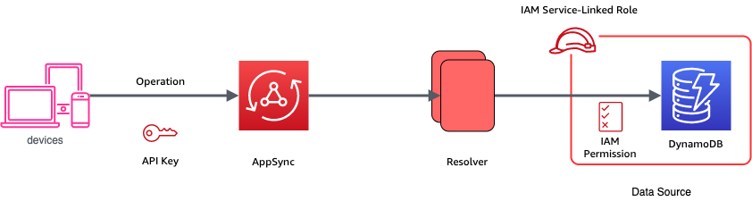

# Architecture

## API

A live API to retrieve coordinates based on the user location can be found at:

```
GET https://8qk05urh03.execute-api.us-east-1.amazonaws.com/location/{query}
```

ex.:

```
GET https://8qk05urh03.execute-api.us-east-1.amazonaws.com/location/Seattle WA 227
```

## GraphQL



A live graphQL can be found at:

```
https://6myhngsf2vdyfet6m5dq7sapvq.appsync-api.us-east-1.amazonaws.com/graphql

header:
[x-api-key]: da2-kxnklhduznc2dc33qtmpjwxtni
```

### ListUsers

```
query ListUsers {
  listAllUsers {
    id
    name
    dob
    address
    description
    imageUrl
    createdAt
    updatedAt
    __typename
  }
}
```

### getUserByName

```
query getUserByName {
    getUserByName(userName: "John") {
        id
        name
        dob
        address
        description
        imageUrl
        createdAt
        updatedAt
        __typename 
    }
}
```

### getUserById

```
query getUserById {
    getUserById(userId: "5c4a8de6-3a0f-4ac7-a46e-0f80a3ba5f67") {
        id
        name
        dob
        address
        description
        imageUrl
        createdAt
        updatedAt
        __typename 
    }
}
```

### deleteUser

```
mutation deleteUser {
    deleteUser(userId: "6e41c8dc-10cb-4967-9ab0-6f943df3feb6")
}
```


### updateUser

```
mutation updateUser {
  updateUser(user: { 
      id: "5c4a8de6-3a0f-4ac7-a46e-0f80a3ba5f67", 
      name: "User 1 Changed 1",
      address: "Address Changed 1",
      description: "Description Changed"
      imageUrl: ""
    }) {
    id
    name
    dob
    address
    description
    imageUrl
    createdAt
    updatedAt
  }
}
```

### createUser

```
mutation createUser {
  createUser(user: { 
      name: "User 1",
      dob: "1989-08-23",
      address: "Address 1",
      description: "Description 1"
      imageUrl: ""
    }) {
    id
    name
    dob
    address
    description
    imageUrl
    createdAt
    updatedAt
  }
}
```